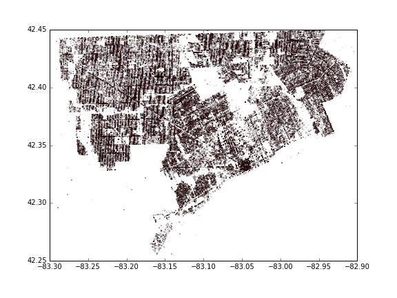

# blight_fight

## Step 1: Building List

__Notice:__
Initially I planned to use parcels downloaded from data.detroitmi.gov, since these building data are more representative of what happens in reality. However, as I move forward, it became clearer that there are some mismatch between downloaded coordinates and the coordinates in course materials. My assumption is that there are some randomized noise introduced to protect privacy.

So instead, buildings are constructed in more routine ways as shown in notebook [Building_List_and_Label.ipynb](./src/Building_List_and_Label.ipynb).
And size info is assumed based on the real buildings mentioned above as shown in [this](./src/Building_size_estimation.ipynb) notebook.

## Step 2: Assign labels

When deriving building list from events, this was already included.

