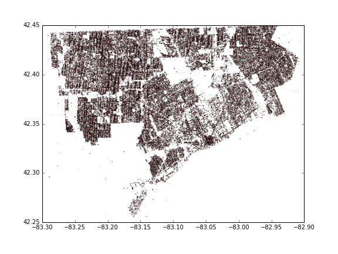

# blight_fight

## Building List

__Notice:__
Initially I planned to use parcels downloaded from data.detroitmi.gov, since these building data are more representative of what happens in reality. However, as I move forward, it became clearer that there are some mismatch between downloaded coordinates and the coordinates in course materials. My assumption is that there are some randomized noise introduced to protect privacy.

Instead of relying on additonal data, buildings are constructed based on events locations as shown in notebook [Building_List_and_Label.ipynb](./src/Building_List_and_Label.ipynb).
However, size info is assumed based on the real buildings mentioned above as shown in [this](./src/Building_size_estimation.ipynb) notebook.

## Assign labels

The distribution of blighted buildings:

## For data analysis please see the [report](./Final_Report.ipynb).

